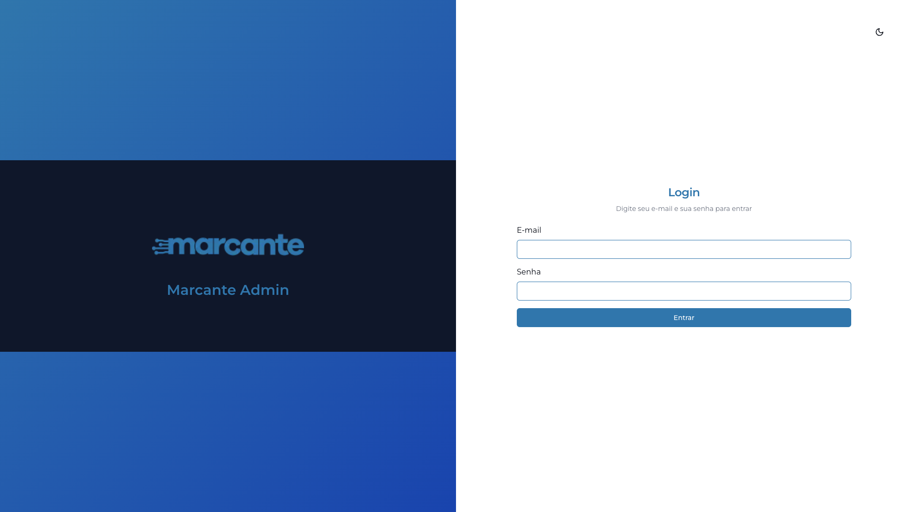

# Marcante Admin

Next.js console for geolocated panels. Operators sign in, see how many panels are online, and inspect them on a map.

The API is [admin-panels-backend](https://github.com/BernardoGelain/admin-panels-backend).

Live login: [admin-panels-chi.vercel.app](https://admin-panels-chi.vercel.app)

## What it is

An authenticated admin: a status summary, a Leaflet map of panel coordinates, and create, update, and list flows for panels.

The repository also contains screens for groups and messages. Panel records are the flow backed by the API in the companion repository.

## Why it exists

Someone operating panels needs the current online and offline split and the location of each unit, not a static table.

## Highlights

- App Router, with the signed-in area under a route group.
- React Query loads the panel list and the online/offline summary.
- The map is loaded with `next/dynamic` and `ssr: false`, because Leaflet needs the browser.
- Forms use react-hook-form. Controls are built on Radix.
- The dev server runs on port 3001 and expects the API at `NEXT_PUBLIC_API_URL`.

## Tech

Next.js 14, React 18, TypeScript, Tailwind CSS, Radix, React Query, React Table, Leaflet, react-hook-form

## Screenshot

Public login screen. The fields are empty.



## Running locally

Requirements: Node.js 18 and the API running locally.

```bash
npm install
cp .env.example .env
npm run dev
```

Open [http://localhost:3001](http://localhost:3001). `.env.example` points `NEXT_PUBLIC_API_URL` at `http://localhost:3000`.
